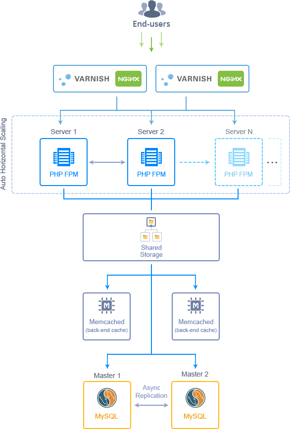

# Highly Available and Auto-scalable Magento Cluster

 

The JPS package deploy Magento 2 that initially contains 2 balancers, 2 application servers, 2 MySQL databases, 2 Memcached and 1 storage container.

##Highlights
Get your highly available and scalable clustered solution for Magento, the extremely popular open source e-commerce platform. This package is designed to ensure the load tracking and distribution, as well as automatic adjusting the amount of allocated resources according to it.

##Environment Topology

###Specifics
 Layer | Server          | Number of CTs   by default | Cloudlets per CT   (reserved/dynamic) | Options
-------|-----------------| :-----------------------------:|:-----------------------------------------:|:-----:
LB     | Varnish(+Nginx 443 port)|           2                    |          1/8                               |   -
AS     | Nginx (PHP-FPM) |            2                   |         1/8                                |  -
DB     |      MySQL      |          2                     |          1/8                               |  -
CH     |     Memcached   |           2                    |         1/8                                |-
ST     |  Shared Storage |          1                     |           1/8                              |   -

* LB - Load balancer
* AS - Application server
* DB - Database
* CH - Cache
* ST - Shared Storage
* CT - Container

**Magento Version**: 2.0.4 
**Varnish Version**: 4.1.1 
**Nginx Version**: 1.8.0 
**Php Version**: PHP 5.6.20 
**MySQL Database**: 5.6.31 
**Memcached Version**: 1.4.15

### Additional functionality:
* MySQL databases with configured asynchronous master-master replication;
* horizontal scaling enabled on compute nodes by CPU load. New AppServer will be added while 70% loading;
* failover sql connection between MySQL and CP nodes based on [mysqlnd_ms](http://php.net/manual/ru/book.mysqlnd-ms.php) plugin;
* Memcached HA for session storage.

---

### Deployment

In order to get this solution instantly deployed, click the "Get It Hosted Now" button, specify your email address within the widget, choose one of the [Jelastic Public Cloud providers](https://jelastic.cloud) and press Install.

 

To deploy this package to Jelastic Private Cloud, import [this JPS manifest](../../raw/master/manifest.jps) within your dashboard ([detailed instruction](https://docs.jelastic.com/environment-export-import#import)).

More information about Jelastic JPS package and about installation widget for your website can be found in the [Jelastic JPS Application Package](https://github.com/jelastic-jps/jpswiki/wiki/Jelastic-JPS-Application-Package) reference.
