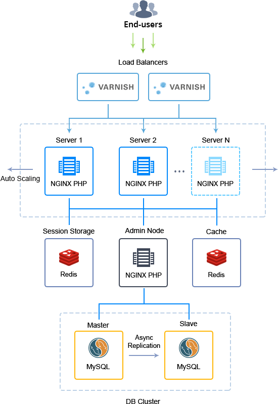
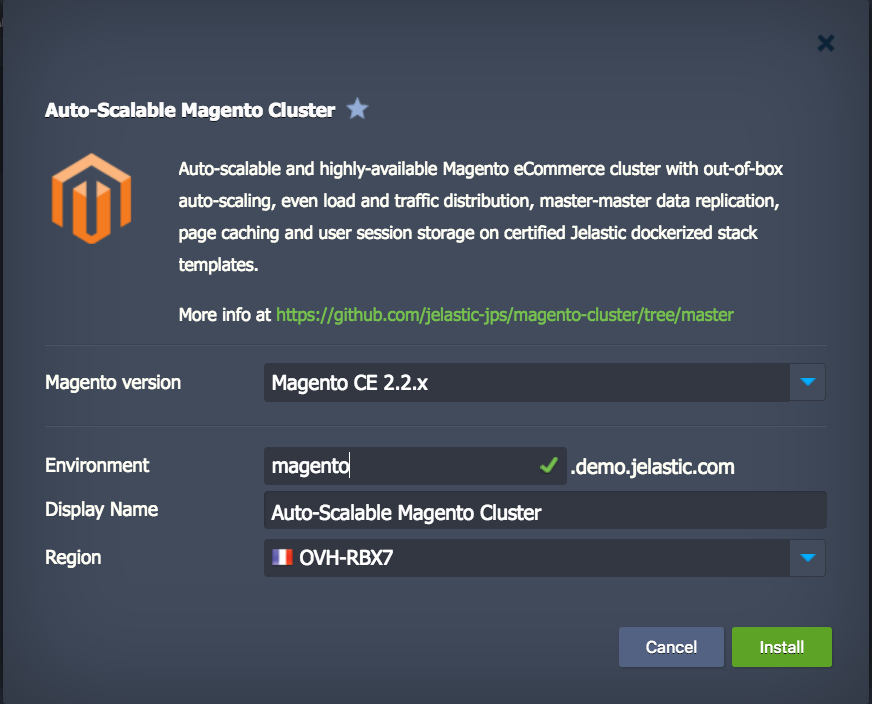
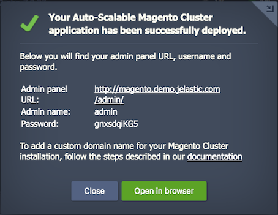

# Auto-Scalable Magento Cluster on certified Jelastic dockerized stack templates.

Advanced highly reliable and auto-scalable Magento cluster on certified Jelastic dockerized stack templates with embedded load balancing, a pair of replicated database servers, separate cache & session storages and storage node.

## Magento Cluster Topology Specifics

Upon the package installation, a new environment with the following topology will be created:
* **Varnish** load balancer to distribute incoming traffic within a cluster and cache all static content; is supplemented with **NGINX** servers as HTTPS proxy (can be manually [scaled](https://docs.jelastic.com/horizontal-scaling) after installation, with all the required changes being applied automatically)
* a pair of **NGINX PHP** application servers to handle Magento itself; are automatically scaled based on the incoming load
* dedicated **[Data Storage](https://docs.jelastic.com/data-storage-container)** node with WordPress-dedicated directory being mounted to all application server nodes, which allows them to operate the same data set rather than keeping and constantly synchronizing changes within their own content copies
* **Redis** storage system to retain user session parameters so that in case one application server instance fails, the second one can retrieve the appropriate data and continue serving the clients  
* **Redis** node for the Magento content cache storing, which results in the shortened application response time and faster loading of the often requested pages
* two **MySQL** database servers with asynchronous master-slave replication to ensure high availability, increase data security, and alleviate system failures

Each container within a cluster comes with predefined [vertical scaling](https://docs.jelastic.com/automatic-vertical-scaling) limit of _**8 cloudlets**_ (equals to 1 GiB of RAM and 3.2 GHz of CPU) and a set of [load alerts](https://docs.jelastic.com/load-alerts) (to notify you when the resources consumption is close to the limit).

Herewith, when [scaling](https://docs.jelastic.com/multi-nodes) either Load Balancer or Application Server layer, the appropriate LB configs (at either newly created or the already existing instance(s) respectively) are adjusted to include data on all application server nodes the load should be distributed across. In addition, NGINX application server is automatically scaled by the system horizontally based on the amount of incoming traffic, which enables it to handle the changeable load.

## Application Server Auto-Scaling Settings

The number of application server nodes in Magento Cluster is adjusted dynamically according to the incoming load by means of [automatic horizontal scaling](https://docs.jelastic.com/automatic-horizontal-scaling). To be more precise, the cluster size is automatically changed under the following conditions:

* _+1 node_ if CPU usage is _more than 70%_ for at least _1 minute_ (up to the maximum allowed containers number per layer)
* _-1 node_ if CPU usage is _less than 20%_ for at least _1 minute_ (down to 2 containers)

The appropriate modifications are automatically applied to add or remove application server nodes, whilst you receive the corresponding email notifications on each scaling operation. Upon creation, each new application server instance is automatically added to the load balancer configs, whilst nodes within the LB layer are restarted to apply the updated settings.

In case you’d like to change the conditions of automatic scaling, adjust the default trigger settings by following the [Automatic Horizontal Scaling](https://docs.jelastic.com/automatic-horizontal-scaling) guide.

## How to Deploy Auto-Scalable Magento Cluster in Docker Containers

In order to get a clustered Magento installation up and running, click the **Deploy to Jelastic** button below and specify your email address in the opened widget. Then, select one of the [Jelastic Public Cloud](https://jelastic.cloud/) providers (in case you don’t have an account at the chosen platform, it will be created automatically) and click **Install**.

Alternatively, you can deploy the package manually by entering your Jelastic dashboard and [importing](https://docs.jelastic.com/environment-import) link to the _**manifest.jps**_ file above.

Within the installation window, choose the required _Magento version_ (1.9.3.x, 2.0.x, 2.1.x and 2.2.x are provided currently), type _Environment_ name and optional _Display Name_ ([environment alias](https://docs.jelastic.com/environment-aliases)), select the preferable [region](https://docs.jelastic.com/environment-regions) (if several ones are available) and click **Install**.

Wait a few minutes for Jelastic to prepare and configure an environment. Once the cluster is up, you will see an informational box with your admin data.

Here, you can click **Open in browser** to access the default _Magento Home Page_ or use the link to _Admin Panel_ and start executing the required management functions.
